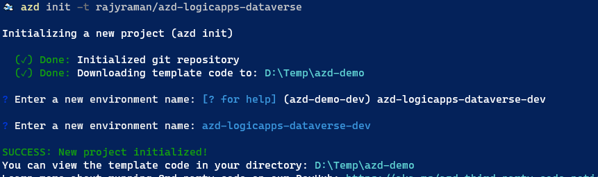
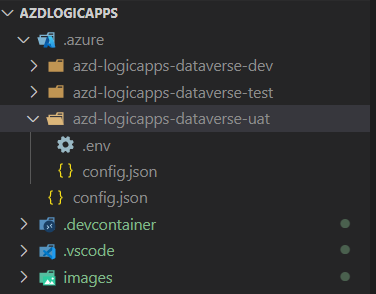
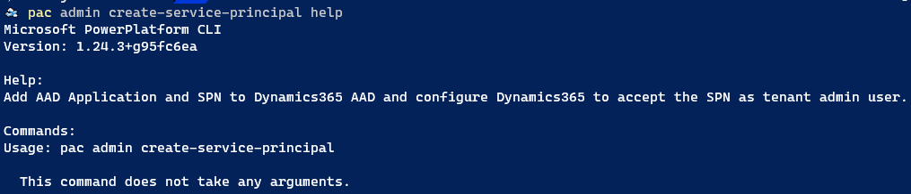
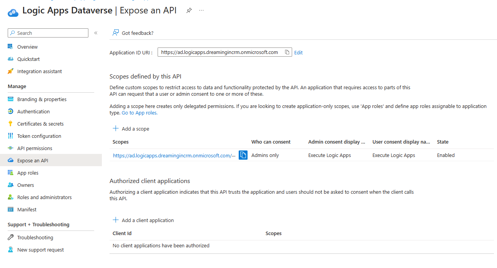
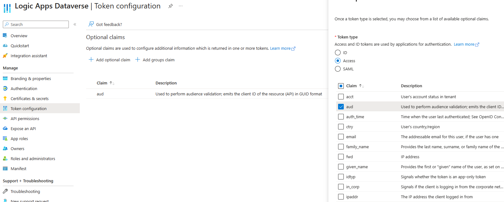
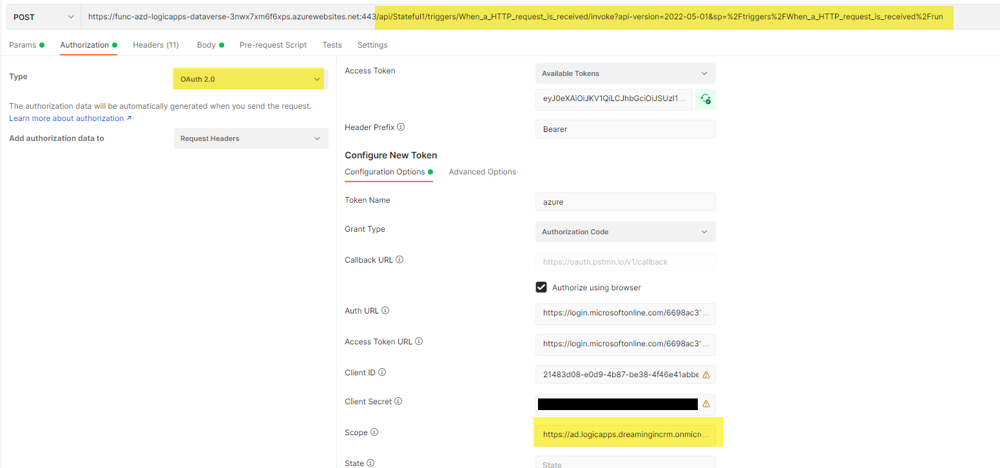
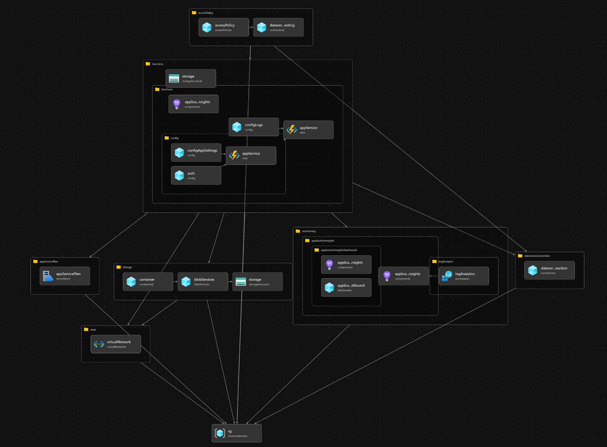

# Logic Apps + azd to connect with Dataverse

[](https://github.com/codespaces/new?hide_repo_select=true&ref=main&repo=654787536&machine=standardLinux32gb&devcontainer_path=.devcontainer%2Fdevcontainer.json&location=WestUs2)
[](https://vscode.dev/redirect?url=vscode://ms-vscode-remote.remote-containers/cloneInVolume?url=https://github.com/rajyraman/azd-logicapps-dataverse)

This is a sample repo that shows how to use Bicep to create Logic App and associated resources to connect with Dataverse. This application uses the Azure Developer CLI (azd) to deploy all the resources.

### Prerequisites

The following prerequisites are required to use this application. Please ensure that you have them all installed locally.

- [Azure Developer CLI](https://aka.ms/azd-install)
- [.NET SDK 6.0](https://dotnet.microsoft.com/download/dotnet/6.0)
- [Azure Functions Core Tools (4+)](https://docs.microsoft.com/azure/azure-functions/functions-run-local)
- [Node.js with npm (16.13.1+)](https://nodejs.org/)

### Checklist
- [ ] Create new App Registration using `pac admin create-service-principal`
- [ ] Note down the Application Id and Secret for the App Registration
- [ ] Add the new App Registration as an Application User in Dataverse Environment and assign correct security role
- [ ] Run `azd init -t rajyraman/azd-logicapps-dataverse`
- [ ] Run `azd env new [ENV NAME]`
- [ ] Fill values for ALLOWED_LOCATIONS, DATAVERSE_APPLICATION_ID, DATAVERSE_APPLICATION_SECRET and DATAVERSE_URL in the .env file
- [ ] Run `azd provision` and `azd deploy` or just `azd up`

### Quickstart
The first step is to download the template on your local machine. For this you need to run the command below.

`azd init -t rajyraman/azd-logicapps-dataverse`

You can choose the environment name here.



You can also create a new environment using the command below.

`azd env new azd-logicapps-dataverse-test`

Now go the `.env` file in the environment folder and create the values for the parameters.



These values will be used in the bicep files. Example file below.

```
ALLOWED_LOCATIONS="australiaeast,australiasoutheast"
AZURE_ENV_NAME="azd-logicapps-dataverse-dev"
AZURE_LOCATION="australiasoutheast"
DATAVERSE_APPLICATION_ID="d3b50372-d7d0-497e-b783-8987250b743d"
DATAVERSE_APPLICATION_SECRET="abcdefgh"
DATAVERSE_URL="https://environment.crm.dynamics.com"
```

Now that you have everything ready you can start provisioning the resources using `azd provision`. Another option is to provision resource and deploy Logic Apps code using `azd up` command. These commands will create and configure all necessary Azure resources - including access policies for Logic Apps to use the Dataverse service connection.

You can create a new App Registration using az CLI, Azure Portal or even Power Platform CLI. Power Platform CLI method is the easiest. The App Registration can used for both Easy Auth token acquistion to lock down the Logic Apps trigger and also connect with Dataverse. The new App Registration has to be added as an Application User to the Dataverse environment because the API connection is using the ApplicationId/Secret to connect with Dataverse.



You also need to add a new scope for the created App Registration that will be used for EasyAuth. In my registration I have called this scope _LogicApps.Run_



One more step is to audience claim to JWT Access Token



To run and test the Logic Apps Standard inside VSCode, you'll also need to create local.settings.json file inside [src](./src/) folder.

```json
{
  "IsEncrypted": false,
  "Values": {
    "AzureWebJobsStorage": "UseDevelopmentStorage=true",
    "FUNCTIONS_WORKER_RUNTIME": "node",
    "WORKFLOWS_RESOURCE_GROUP_NAME": "rg-azd-logicapps-dataverse",
    "WORKFLOWS_LOCATION_NAME": "australiasoutheast",
    "DATAVERSE_URL": "https://environment.crm.dynamics.com"
}
```

### Running Logic App from Postman

Make a note of the trigger URL from the Logic Apps page in Azure Portal and strip out the SAS token from the URL because we need to run the Logic Apps using the Bearer token. Below is how you can run this on Postman. Make sure that you have the right scope, Authorisation URL and Access Token URL



Below is the body of the request that has to be sent to the Logic App.


### Architecture



### References
1. https://github.com/pamelafox/fastapi-azure-function-apim
2. https://github.com/Azure-Samples/function-app-arm-templates
3. https://github.com/marnixcox/logicapp-standard-func
4. https://techcommunity.microsoft.com/t5/integrations-on-azure-blog/trigger-workflows-in-standard-logic-apps-with-easy-auth/ba-p/3207378
5. https://www.youtube.com/watch?v=tawHXz6qGQI
